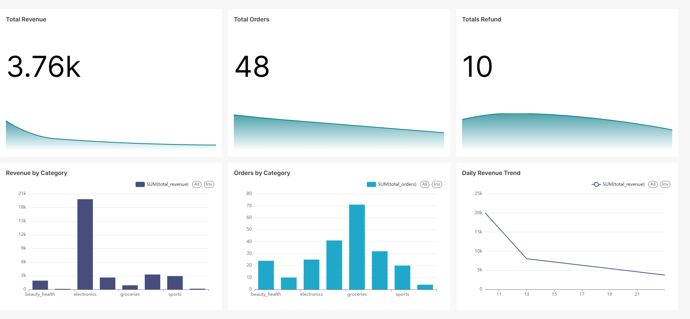

# E-Commerce Lakehouse Analytics Pipeline

An end-to-end local data lakehouse project for e-commerce analytics. The pipeline generates synthetic user events, streams them through Kafka, stores Bronze and Silver Delta Lake tables on MinIO, builds a Gold sales metrics table with Spark batch processing, queries the lakehouse with Trino, and visualizes the result in Apache Superset.

This project is designed as a practical data engineering portfolio project. It demonstrates streaming ingestion, medallion architecture, batch aggregation, workflow orchestration, SQL serving, and dashboarding in a Docker Compose environment.


## Project Highlights

- Built a local lakehouse using Kafka, Spark Structured Streaming, Delta Lake, MinIO, Airflow, Trino, and Superset.
- Implemented a medallion architecture with Bronze, Silver, and Gold Delta tables.
- Used Spark streaming jobs for continuous Kafka-to-Bronze and Bronze-to-Silver processing.
- Used Airflow to orchestrate daily event generation and Gold table refresh.
- Exposed the Gold Delta table through Trino for BI consumption.
- Created a Superset dashboard for revenue, orders, refunds, and category performance.

## Architecture

```text
Airflow DAG
  |
  |-- generate_data
  |      Producer -> Kafka topic: ecommerce-events
  |
  |-- wait_for_streaming
  |      Wait for Bronze/Silver streaming jobs
  |
  |-- gold_job
         Trigger Gold batch through gold-runner

Kafka
  |
  v
bronze-stream
  Kafka -> Bronze Delta
  s3a://ecommerce/bronze/events
  |
  v
silver-stream
  Bronze Delta -> Silver Delta
  s3a://ecommerce/silver/events
  |
  v
gold-runner
  Silver Delta -> Gold Delta
  s3a://ecommerce/gold/sales_metrics
  |
  v
Trino -> Superset Dashboard
```

## Tech Stack

| Component | Purpose |
| --- | --- |
| Apache Kafka | Event broker for generated e-commerce events |
| Apache Spark 3.5.1 | Streaming and batch data processing |
| Delta Lake | Table format for Bronze, Silver, and Gold layers |
| MinIO | S3-compatible object storage |
| Apache Airflow | Daily pipeline orchestration |
| Trino | SQL query engine for Delta Lake tables |
| Apache Superset | BI dashboard and visualization |
| Docker Compose | Local multi-service runtime |

## Data Pipeline

### 1. Event Producer

Main file:

```text
producer/producer.py
```

The producer generates synthetic e-commerce activity events and sends them to Kafka topic `ecommerce-events`.

Event fields:

- `event_time`
- `user_id`
- `product_id`
- `action`
- `price`
- `revenue`
- `category`

Airflow runs the producer with:

```bash
KAFKA_BOOTSTRAP_SERVERS=kafka:9092 NUM_EVENTS=1000 python producer.py
```

### 2. Bronze Layer

Main file:

```text
spark/apps/streaming_job.py
```

The `bronze-stream` service runs continuously. It reads Kafka events, parses JSON messages, and writes raw records to Delta Lake.

Output:

```text
s3a://ecommerce/bronze/events
```

Checkpoint:

```text
spark/checkpoints/ecommerce-events
```

### 3. Silver Layer

Main file:

```text
spark/apps/silver_job.py
```

The `silver-stream` service runs continuously. It reads Bronze Delta data, cleans and enriches the events, and writes the result to the Silver Delta table.

Transformations:

- Cast `event_time` to timestamp.
- Remove rows with null `user_id`.
- Remove rows with null `product_id`.
- Drop duplicate rows.
- Add `event_date`.
- Add `event_hour`.
- Add `is_purchase`.
- Add `is_refund`.

Output:

```text
s3a://ecommerce/silver/events
```

Checkpoint:

```text
spark/checkpoints/silver
```

### 4. Gold Layer

Main files:

```text
spark/apps/batch_job.py
spark/apps/gold_runner.sh
```

Gold is a batch layer. Airflow writes a trigger file, and the `gold-runner` service runs the Spark batch job.

Input:

```text
s3a://ecommerce/silver/events
```

Output:

```text
s3a://ecommerce/gold/sales_metrics
```

The Gold table is grouped by:

- `event_date`
- `category`

Metrics:

- `total_revenue`
- `total_orders`
- `total_refunds`
- `unique_users`
- `unique_products`
- `avg_price`
- `max_price`
- `min_price`

## Airflow Orchestration

Main file:

```text
airflow/dags/ecommerce_pipeline.py
```

DAG flow:

```text
generate_data -> wait_for_streaming -> gold_job
```

Tasks:

- `generate_data`: produces 1000 events into Kafka.
- `wait_for_streaming`: waits for Bronze and Silver to process the new events.
- `gold_job`: creates a Gold trigger file and waits for success or failure.

Airflow communicates with `gold-runner` through:

```text
airflow/triggers
```

Trigger files:

- `gold.request`: request a Gold batch run.
- `gold.done`: Gold batch completed successfully.
- `gold.failed`: Gold batch failed.

## Trino Setup

Trino queries Delta Lake data directly from MinIO. The catalog config is located at:

```text
trino/catalog/delta.properties
```

After the Gold table exists, register it in Trino:

```sql
CREATE SCHEMA IF NOT EXISTS delta.default
WITH (location = 's3://ecommerce/');

CALL delta.system.register_table(
    schema_name => 'default',
    table_name => 'sales_metrics',
    table_location => 's3://ecommerce/gold/sales_metrics'
);
```

Test query:

```sql
SELECT min(event_date), max(event_date), count(*)
FROM delta.default.sales_metrics;
```

## Superset Dashboard

Superset connects to Trino with this SQLAlchemy URI:

```text
trino://trino@trino:8080/delta/default
```

Dataset:

```text
delta.default.sales_metrics
```

Dashboard name:

```text
E-Commerce Lakehouse Sales Analytics
```

Dashboard charts:

- `Total Revenue`: Big Number with `SUM(total_revenue)`.
- `Total Orders`: Big Number with `SUM(total_orders)`.
- `Revenue by Category`: Bar chart with `category` and `SUM(total_revenue)`.
- `Orders by Category`: Bar chart with `category` and `SUM(total_orders)`.
- `Daily Revenue Trend`: Line chart with `event_date` and `SUM(total_revenue)`.

Exported dashboard files:

```text
dashboards/Ecommerce Dashboardv1.html
dashboards/ecommerce-dashboard-2026-06-23T13-49-34.208Z.jpg
```

Dashboard preview:



## Docker Services

Main services:

- `zookeeper`
- `kafka`
- `minio`
- `spark-master`
- `spark-worker`
- `bronze-stream`
- `silver-stream`
- `gold-runner`
- `postgres-airflow`
- `airflow-webserver`
- `airflow-scheduler`
- `trino`
- `superset`

`postgres-airflow` is used only as the Airflow metadata database. This project does not use PostgreSQL as a data warehouse.

## How To Run

Start all services:

```bash
docker compose up -d
```

Check service status:

```bash
docker compose ps
```

Open the UIs:

| Service | URL |
| --- | --- |
| Airflow | http://localhost:8081 |
| Spark Master | http://localhost:8080 |
| MinIO Console | http://localhost:9001 |
| Trino | http://localhost:8085 |
| Superset | http://localhost:8088 |

Run the daily pipeline:

1. Open Airflow.
2. Trigger DAG `ecommerce_pipeline`.
3. Wait until all tasks are successful.
4. Check Gold data in Trino.
5. Refresh the Superset dashboard.

Check Gold table:

```bash
docker compose exec trino trino --execute "SELECT min(event_date), max(event_date), count(*) FROM delta.default.sales_metrics"
```

## Stop And Restart

Recommended stop command:

```bash
docker compose stop
```

Start again:

```bash
docker compose up -d
```

Using `docker compose stop` keeps containers, volumes, and Spark checkpoints, so the next run can continue safely.

Avoid this command if you want to keep all runtime state:

```bash
docker compose down -v
```

`docker compose down` without `-v` keeps Docker volumes, but it recreates containers. In this project, that can reset Kafka while Spark checkpoints still exist, which may cause Bronze/Silver to skip new data until checkpoints are reset.

## Useful Commands

View logs:

```bash
docker compose logs -f bronze-stream
docker compose logs -f silver-stream
docker compose logs -f gold-runner
docker compose logs -f airflow-scheduler
```

Restart streaming services:

```bash
docker compose restart bronze-stream silver-stream
```

Trigger Gold manually:

```bash
del /q airflow\triggers\gold.done airflow\triggers\gold.failed 2>nul
echo manual-rerun > airflow\triggers\gold.request
docker compose logs -f gold-runner
```

Check Kafka topic offset:

```bash
docker compose exec kafka kafka-run-class kafka.tools.GetOffsetShell --broker-list kafka:9092 --topic ecommerce-events --time -1
```

Reset streaming checkpoints after Kafka is recreated:

```bash
docker compose stop bronze-stream silver-stream
rmdir /s /q spark\checkpoints\ecommerce-events
rmdir /s /q spark\checkpoints\silver
docker compose start bronze-stream silver-stream
```

Register Trino table again after container recreation:

```bash
docker compose exec trino trino --execute "CREATE SCHEMA IF NOT EXISTS delta.default WITH (location = 's3://ecommerce/'); CALL delta.system.register_table(schema_name => 'default', table_name => 'sales_metrics', table_location => 's3://ecommerce/gold/sales_metrics');"
```

## Troubleshooting

### Superset does not load data

Check whether Trino can query the Gold table:

```bash
docker compose exec trino trino --execute "SELECT min(event_date), max(event_date), count(*) FROM delta.default.sales_metrics"
```

If Trino says schema or table does not exist, register the table again:

```bash
docker compose exec trino trino --execute "CREATE SCHEMA IF NOT EXISTS delta.default WITH (location = 's3://ecommerce/'); CALL delta.system.register_table(schema_name => 'default', table_name => 'sales_metrics', table_location => 's3://ecommerce/gold/sales_metrics');"
```

### Gold has old data

Bronze and Silver may have processed new events, but Gold may have run too early. Rerun Gold after Silver finishes:

```bash
del /q airflow\triggers\gold.done airflow\triggers\gold.failed 2>nul
echo rerun-after-silver > airflow\triggers\gold.request
docker compose logs -f gold-runner
```

Then verify:

```bash
docker compose exec trino trino --execute "SELECT min(event_date), max(event_date), count(*) FROM delta.default.sales_metrics"
```

### Bronze or Silver has no new data after restart

If Kafka was recreated but Spark checkpoints were kept, reset the streaming checkpoints:

```bash
docker compose stop bronze-stream silver-stream
rmdir /s /q spark\checkpoints\ecommerce-events
rmdir /s /q spark\checkpoints\silver
docker compose start bronze-stream silver-stream
```

## Project Structure

```text
airflow/
  dags/
    ecommerce_pipeline.py
  triggers/
    .gitkeep

dashboards/
  Ecommerce Dashboardv1.html
  ecommerce-dashboard-2026-06-23T13-49-34.208Z.jpg

producer/
  producer.py

spark/
  apps/
    streaming_job.py
    silver_job.py
    batch_job.py
    gold_runner.sh
  checkpoints/
  ivy/

trino/
  catalog/
    delta.properties

superset/
  Dockerfile

docker-compose.yaml
README.md
```

## Future Improvements

- Persist Kafka data with a Docker volume to avoid offset/checkpoint mismatch after container recreation.
- Replace the fixed Airflow wait task with a sensor that checks Silver checkpoint progress.
- Compact small Delta files periodically for faster Gold batch processing.
- Add automated data quality checks before writing Gold.
- Add a reusable Superset import bundle for dashboard migration.
